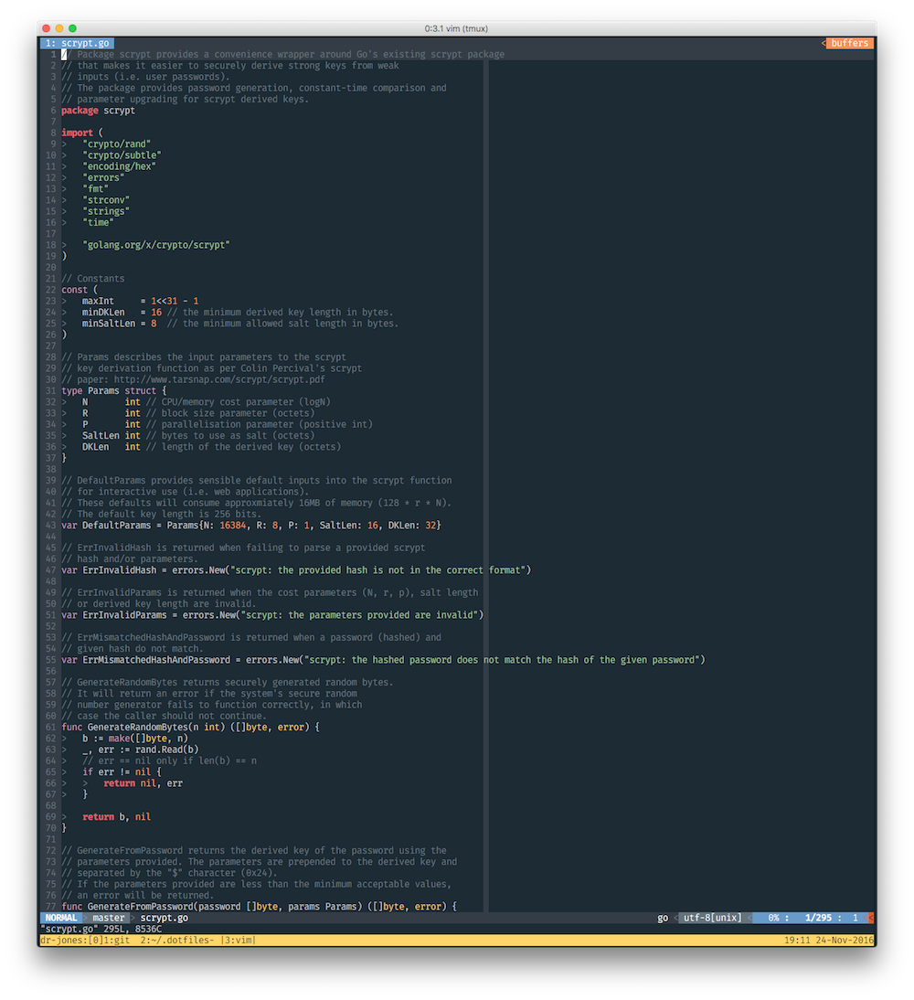

dotfiles
========

elithrar/dotfiles using [rcm](https://github.com/thoughtbot/rcm) to manage them. Install with `rcup -d ~/.dotfiles`.

Notes:

* My `.vimrc` is commented and clear about what-applies-to-what.
* I use the [Fira Mono](http://mozilla.github.io/Fira/) typeface
* ... and the [Oceanic Next](https://github.com/mhartington/oceanic-next) theme.

