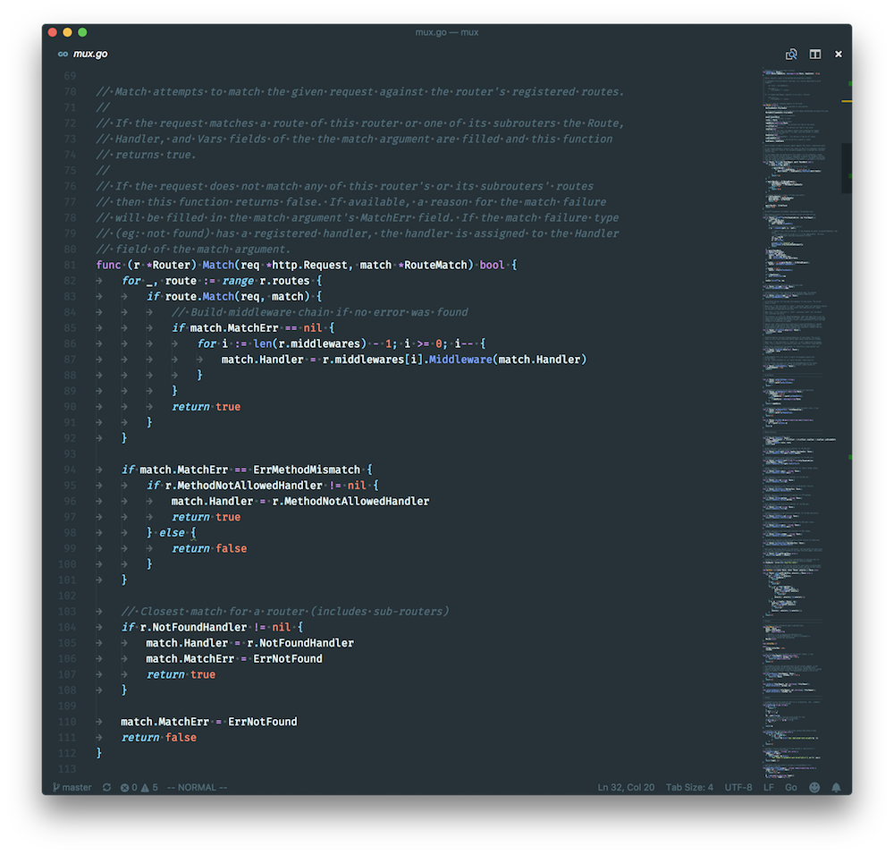
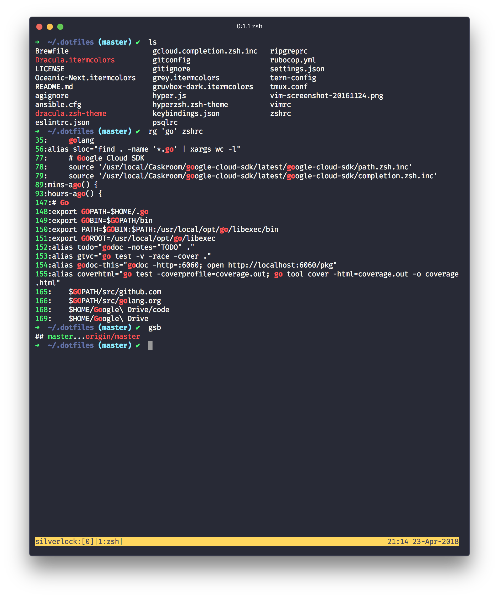

dotfiles
========

elithrar/dotfiles using [rcm](https://github.com/thoughtbot/rcm) to manage them. Install with `rcup -d ~/.dotfiles`.

Notes:

* I currently use [Hyper 2](https://zeit.co/blog/hyper2) as my terminal emulator, with the [Dracula](https://github.com/dracula/hyper) theme
* zsh and [oh-my-zsh](https://github.com/robbyrussell/oh-my-zsh) as my shell
* My `.vimrc` is commented and clear about what-applies-to-what.
* I use the [Fira Mono](http://mozilla.github.io/Fira/) typeface.

## VS Code

## Terminal (Hyper)

